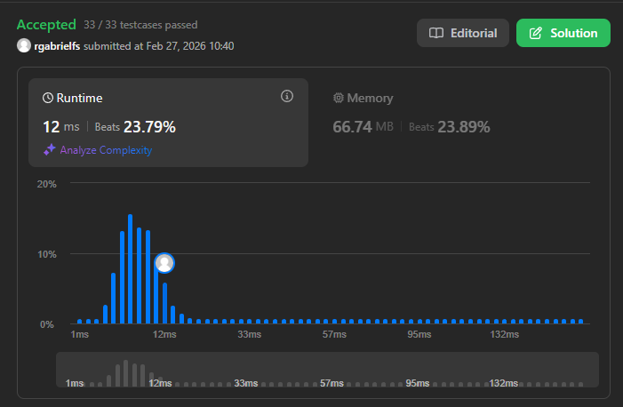

# Problema: Min Stack

Autor: **Ricardo Fialho**.

Revisado por:

Design a stack that supports push, pop, top, and retrieving the minimum element in constant time.

Implement the MinStack class:

- MinStack() initializes the stack object.
- void push(int val) pushes the element val onto the stack.
- void pop() removes the element on the top of the stack.
- int top() gets the top element of the stack.
- int getMin() retrieves the minimum element in the stack.

You must implement a solution with O(1) time complexity for each function.

# Exemplo:

## Primeiro:

**Entrada:** ["MinStack","push","push","push","getMin","pop","top","getMin"]
[[],[-2],[0],[-3],[],[],[],[]]

**Saída:** [null,null,null,null,-3,null,0,-2]

**Explicação:**
MinStack minStack = new MinStack();
minStack.push(-2);
minStack.push(0);
minStack.push(-3);
minStack.getMin(); // return -3
minStack.pop();
minStack.top(); // return 0
minStack.getMin(); // return -2

# Restrições

- `-2^31 <= val <= 2^31 - 1`
- Methods `pop`, `top` and `getMin` operations will always be called on non-empty stacks
- At most `3 * 10^4` calls will be made to `push`, `pop`, `top`, and `getMin`.

# Como o LLM foi utilizado:

Foi desenvolvida uma solução mas que não seguia os padrões do `Clean Code`, desse modo, sugeri à LLM uma formatação que tornasse o código mais otimizado, e este foi o resultado.

# Evidência

