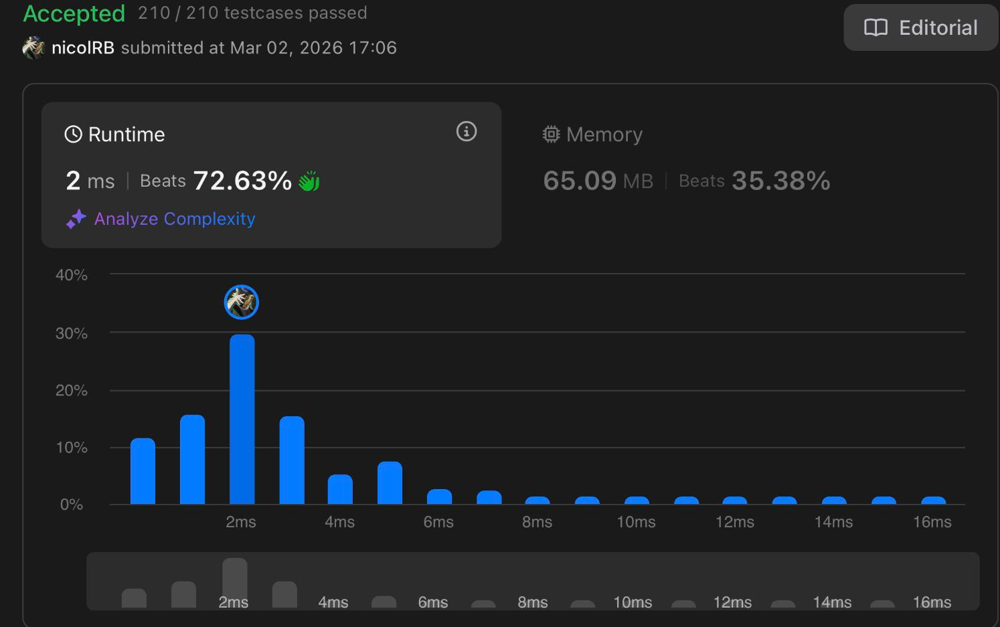

# Problema: Maximum Subarray

Autor: **Nicolas Borges**
Revisado por:

Dado um array de inteiros nums, encontre o subarray com a maior soma e retorne essa soma.

#

## Primeiro:

**Entrada:** 

nums = [-2,1,-3,4,-1,2,1,-5,4]

**Saída:**

6

**Explicação:**

O subarray [4,-1,2,1] possui a maior soma, que é 6.

## Segundo:

**Entrada:** 

nums = [1]

**Saída:** 

1

**Explicação:** 

O subarray [1] possui a maior soma, que é 1.

## Terceiro:

**Entrada:* 

nums = [5,4,-1,7,8]

**Saída:** 

23

**Explicação:** 

O subarray [5,4,-1,7,8] possui a maior soma, que é 23.

# Restrições:

* `1 <= nums.length <= 10⁵`

* `-10⁴ <= nums[i] <= 10⁴`

# Desafio extra:

Se você já encontrou a solução com complexidade O(n), tente implementar outra solução utilizando a abordagem de divisão e conquista, que é mais sutil.

# Como o LLM foi utilizado:

Quando me faltava compreensão de como funcionava algo na línguagem TypeScript, pediria uma explicação sobre as funções e suas estruturas para fazer uso na programação de uma solução, e pedia ajuda quanto quais eram os buracos na lógica que estava usando quando falhava.

# Evidência

