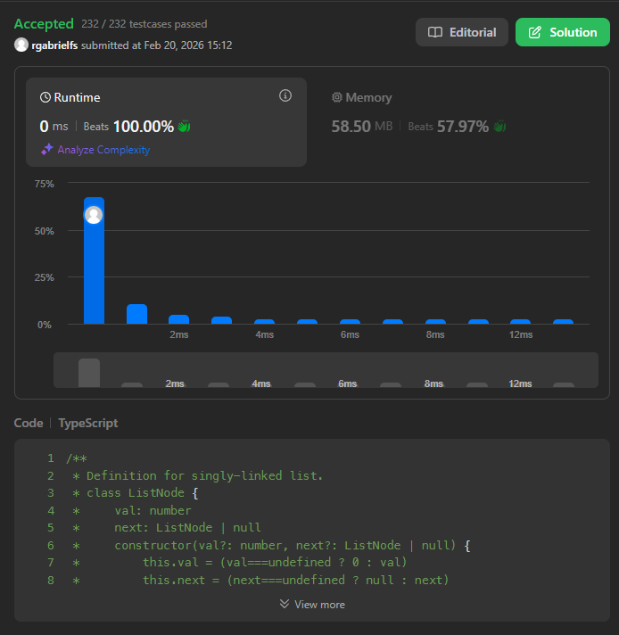

# Problema: Rotate List

Autor: **Ricardo Fialho**.

Revisado por:

Given the head of a linked list, rotate the list to the right by k places.

# Exemplo:

## Primeiro:

**Entrada:** head = [1,2,3,4,5], k = 2

**Saída:** [[4,5,1,2,3]

## Segundo:

**Entrada:** head = [0,1,2], k = 4

**Saída:** [2,0,1]

# Restrições

- `The number of nodes in the list is in the range [0, 500].`
- `-100 <= Node.val <= 100`
- `0 <= k <= 2 * 109`

# Como o LLM foi utilizado:

Tive uma breve ideia de como faria em python e depois sugeri ao modelo de linguagem a a seguinte questao: como posso desenvolver isto em Typescript? A resolucao foi breve e simples.

# Evidência

