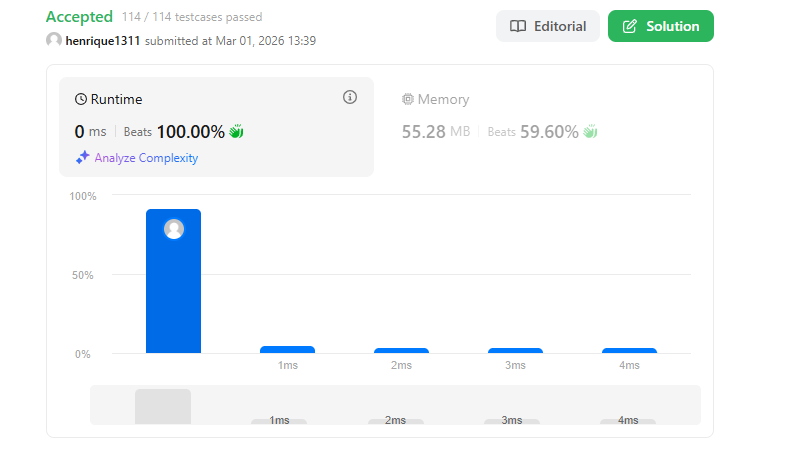

# Problema: Plus One

Autor: **Henrique**

Revisado por: **João Menna**

Você recebe um número inteiro grande representado como um array de dígitos `digits`, onde cada `digits[i]` é o i-ésimo dígito do inteiro. Os dígitos são ordenados do mais significativo para o menos significativo, da esquerda para a direita. O número não contém zeros à esquerda.

O objetivo é incrementar o número em uma unidade e retornar o array resultante.

---

# Exemplo

## Primeiro

**Entrada:** `digits = [1, 2, 3]`

**Saída:** `[1, 2, 4]`

**Explicação:** 123 + 1 = 124.

## Segundo

**Entrada:** `digits = [4, 3, 2, 1]`

**Saída:** `[4, 3, 2, 2]`

**Explicação:** 4321 + 1 = 4322.

## Terceiro

**Entrada:** `digits = [9]`

**Saída:** `[1, 0]`

**Explicação:** 9 + 1 = 10.

---

# Restrições

* `1 <= digits.length <= 100`
* `0 <= digits[i] <= 9`
* O array `digits` não contém zeros à esquerda.

---

# Como o LLM foi utilizado:

Neste problema, discuti com o LLM sobre as limitações de tipos numéricos. Entendi que, como o array pode ter até 100 posições, converter o array para um `number` ou `BigInt` antes de somar poderia ser arriscado ou menos performático em certos ambientes. 

# Evidência

