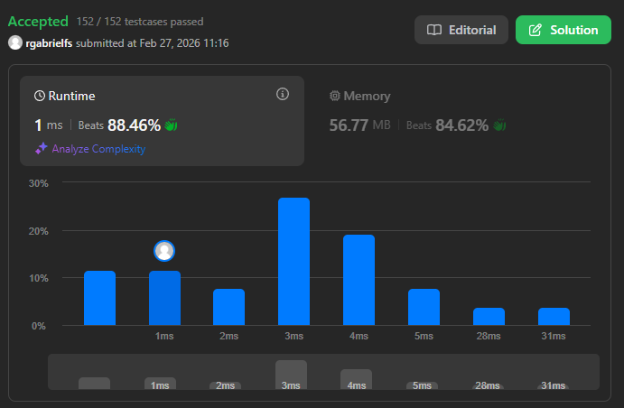

# Problema: Validate Stack Sequences

Autor: **Ricardo Fialho**.

Revisado por:

Given two integer arrays `pushed` and `popped` each with distinct values, return `true` if this could have been the result of a sequence of push and pop operations on an initially empty stack, or `false` otherwise.

# Exemplo:

## Primeiro:

**Entrada:** pushed = [1,2,3,4,5], popped = [4,5,3,2,1]

**Saída:** true

**Explicação:**
We might do the following sequence:
push(1), push(2), push(3), push(4),
pop() -> 4,
push(5),
pop() -> 5, pop() -> 3, pop() -> 2, pop() -> 1

## Segundo:

**Entrada:** pushed = [1,2,3,4,5], popped = [4,3,5,1,2]

**Saída:** false

**Explicação:**
1 cannot be popped before 2.

# Restrições

- `1 <= pushed.length <= 1000`
- `0 <= pushed[i] <= 1000`
- All the elements of `pushed` are unique.
- `popped.length == pushed.length`
- `popped` is a permutation of `pushed`

# Como o LLM foi utilizado:

Foi desenvolvida uma solução mas que não seguia os padrões do `Clean Code`, desse modo, sugeri à LLM uma formatação que tornasse o código mais otimizado e com menos de 5ms de runtime (Tempo de execução inicial), este foi o resultado.

# Evidência

